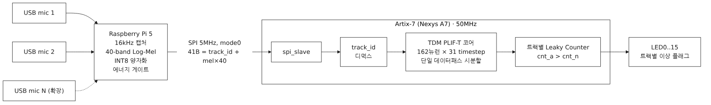
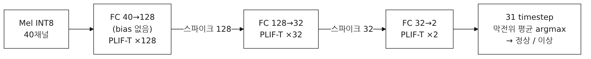
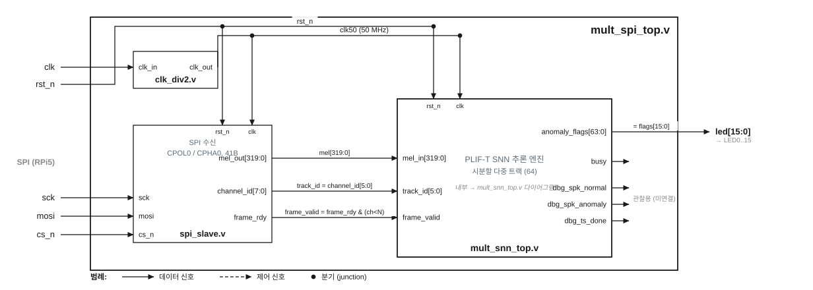

# SpikeSense-Edge

[English](README.md) | **한국어**

---

**FPGA 엣지 기반 SNN 음향 이상 감지 시스템**

---

## 1. 배경

팬·회전 기계의 고장은 이상음으로 먼저 드러나지만, 오디오를 클라우드로 보내 분석하면 지연·대역폭·프라이버시 부담이 크다. SpikeSense-Edge는 전처리부터 추론까지 엣지에서 끝낸다.

- **전처리**: Raspberry Pi 5가 마이크 오디오를 Mel Spectrogram(INT8 40채널)으로 변환
- **추론**: PyTorch로 학습한 PLIF-T SNN을 INT8 양자화해 Xilinx Artix-7 FPGA에 이식, 저전력으로 실시간 판정
- SNN(Spiking Neural Network)은 스파이크 기반 희소 연산으로 엣지 추론에 유리

---

## 2. 시스템 구성



| 구성 요소               | 역할                                                       |
| ----------------------- | ---------------------------------------------------------- |
| Raspberry Pi 5          | N채널 오디오 수집, Mel Spectrogram 전처리, SPI 전송        |
| Nexys A7 100T (Artix-7) | PLIF-T SNN 추론 — 단일 데이터패스 시분할로 다중 트랙 처리 |

---

## 3. 소프트웨어 모델 · 하드웨어 아키텍처

### 3.1 소프트웨어 모델 — PLIF-T SNN

**PLIF-T SNN (Parametric LIF with Learnable Threshold)**



- 입력: ~1초 오디오 버퍼(31 × 32ms = 992ms) → 40채널 Log-Mel Spectrogram → 31 타임스텝
- 뉴런: β(감쇠율)와 V_th(발화 임계값)가 모두 학습 파라미터
- 분류: 타임스텝별 막전위 평균의 argmax → 정상(0) / 이상(1)
- 총 가중치: 9,280개 (하드웨어에서 INT8 양자화)

**학습 설정**

| 항목        | 값                                                    |
| ----------- | ----------------------------------------------------- |
| Loss        | Focal Loss (γ=2, 클래스 빈도 기반 가중치)            |
| Optimizer   | Adam (lr=0.002, weight_decay=1e-5)                    |
| Scheduler   | Cosine Annealing                                      |
| 데이터 증강 | SpecAugment (주파수·시간 마스킹 15%), Mixup (α=0.2) |
| 피처        | 40-mel, FFT=1024, hop=512, 16kHz                      |

### 3.2 하드웨어 아키텍처 — RTL



**설계 사양** (`hardware/src/`)

| 항목            | 사양                                                                                               |
| --------------- | -------------------------------------------------------------------------------------------------- |
| 타깃 보드       | Nexys A7 100T (XC7A100T)                                                                           |
| 입력 인터페이스 | SPI slave (5MHz, 41바이트 패킷)                                                                    |
| 동작 클럭       | 50 MHz (보드 100MHz E3 →`clk_div2` 2분주)                                                       |
| 채널/트랙       | 다중 트랙 시분할 (`N_TRACKS`, 기본 64) — 단일 데이터패스 공유. 초기 듀얼채널(snn_top×2)은 동결 |
| 처리 방식       | 시분할(Time-Multiplexing) — 162뉴런/타임스텝, 타임스텝당 ≈9,607클럭                              |
| 가중치 저장     | BRAM (9,280 × INT8 ≈ 74Kbits, 전 트랙 공유)                                                      |
| 막전위 형식     | 16-bit signed, Soft Reset (트랙별 BRAM)                                                            |
| 이상 판정       | 트랙별 Leaky Counter (`cnt_anomaly > cnt_normal`); 데모 top은 31ts 다수결                        |
| 출력            | `anomaly_flags[N]` → LED. 보드 자가진단 시 LED15=PASS                                           |

**모듈 맵**

| 그룹       | 모듈                                                                                                        |
| ---------- | ----------------------------------------------------------------------------------------------------------- |
| 연산       | `plift_core.v` (PLIF-T 뉴런), `mac_unit.v` (INT8×INT8→INT16 MAC)                                      |
| 메모리     | `weight_bram.v`, `param_rom.v` (β/V_th), `membrane_mem.v` / `membrane_mem_mult.v`, `spike_mem.v` |
| 제어       | `control_fsm.v` / `control_fsm_mult.v`, `anomaly_judge.v` / `_mult.v` / `_seg.v`, `clk_div2.v`  |
| Top (동결) | `snn_top.v` (단일), `dual_snn_top.v` (2채널 + `spi_slave.v`)                                          |
| Top (활성) | `mult_snn_top.v` (시분할 엔진), `mult_spi_top.v` (보드), `mult_selftest_top.v` (자가진단)             |
| Top (데모) | `demo_snn_top.v` / `demo_spi_top.v` (세그먼트 판정, 다수결)                                             |

**SPI 프로토콜** (RPi5 → FPGA)

- 배선: JA1=SCK, JA2=MOSI, JA3=CS_n, GND
- 패킷: CS 하강 → 41바이트 → CS 상승. Byte 0 = `track_id(0~N-1)`, Byte 1~40 = `mel_int8[0..39]`
- 5 MHz, mode 0 (CPOL=0, CPHA=0), 프레임 간격 ≥1ms
- 수신 전용(MOSI) — MISO 리드백 없음. 이상 판정은 보드 LED[track]로 관찰

---

## 4. 디렉토리 구조

```
SpikeSense-Edge/
├── software/
│   ├── snn_model.py            # PLIF-T SNN 모델 정의 (PyTorch)
│   ├── train.py                # 학습 루프 (Focal Loss, Mixup, Resume 지원)
│   ├── test_model_numpy.py     # NumPy 순전파 검증 (PyTorch 불필요)
│   ├── export_weights.py       # INT8 가중치 추출 → hex 파일
│   ├── evaluate_dcase.py       # held-out 추론 → 세그먼트별 원시 점수 CSV
│   ├── plot_metrics.py         # CSV → 학습 곡선 + ROC / F1 / PR 곡선
│   ├── make_excel_template.py  # F1/ROC/PR 자동 갱신 엑셀 템플릿 생성기
│   ├── make_hw_test_vectors.py # HW 테스트용 Mel 벡터 (LED ON/OFF 보장)
│   ├── compare_quant.py        # float32(PyTorch) vs INT8(양자화) 정확도 비교
│   ├── best_model_mimii_v2-1.pth  # 최고 성능 모델 (MIMII 데이터셋)
│   ├── data_dcase/             # 정식 학습 데이터 (DCASE — normal/, anomaly/)
│   └── data_mimii/             # 경량 검증 데이터 (MIMII)
│
├── hardware/
│   ├── src/                    # RTL — Mel + PLIF-T (snn / dual / mult-시분할 / selftest / demo top)
│   │   └── weights/            # INT8 가중치 hex + 골든 벡터
│   ├── constraints/            # Vivado XDC 핀 제약 (dual / mult / selftest / demo)
│   ├── fpga/                   # Vivado 자동화 tcl (프로젝트 / 비프로젝트 / selftest)
│   ├── testbench/              # 테스트벤치 .v 소스
│   └── sim/                    # 컴파일 결과물 (.gitignore)
│
├── rpi/                        # RPi5 소프트웨어
│   ├── requirements.txt        # numpy, scipy, soundfile, sounddevice, spidev, luma.oled
│   ├── capture_mel.py          # USB 마이크 캡처 + Mel INT8 (순수 numpy)
│   ├── snn_infer.py            # NumPy INT8 추론 (dry-run, RTL bit-exact)
│   ├── fpga_spi.py             # SPI 드라이버 (5MHz, 41B 패킷, track_id)
│   ├── main.py                 # 메인 루프 (다중 트랙 파이프라인, --dry-run)
│   ├── hw_test.py              # SPI 통합 테스트 (wiring/led/sweep)
│   ├── oled_display.py         # 1.3" I2C OLED(SH1106) 정상/이상 표시 (데모)
│   └── demo.py                 # 실보드 2트랙 데모 (Enter 스텝, OLED+LED)
│
└── documents/                  # 논문, 발표자료, 학습 해설서
    ├── papers/                 # 학회 논문 (docx/pdf) + 블록 다이어그램
    ├── presentation/           # 포스터(pdf/pptx), 발표자료, 12분 대본, 데모 영상
    └── study_guide/            # 학부생용 25장 학습 해설서 (Markdown)
```

---

## 5. 시작하기

### 요구 사항

```bash
pip install torch numpy librosa soundfile scikit-learn
```

### 데이터 준비

```
data_dcase/
├── normal/     # 정상 작동 WAV 파일 (16kHz 권장)
└── anomaly/    # 이상 작동 WAV 파일
```

지원 데이터셋: [MIMII Dataset](https://zenodo.org/record/3384388), [DCASE 2020 Task 2](https://dcase.community/challenge2020/task2-unsupervised-detection-of-anomalous-sounds)

### 학습

```bash
cd software

# 새로 학습
python train.py --data_dir data_dcase --model_name my_model.pth --epochs 150 --batch_size 256

# 이어서 학습 (epochs는 추가가 아닌 최종 목표 에포크)
python train.py --data_dir data_dcase --model_name my_model.pth --epochs 300 --resume
```

| 옵션             | 설명                                               | 기본값             |
| ---------------- | -------------------------------------------------- | ------------------ |
| `--data_dir`   | 데이터 최상위 폴더 (하위에 normal/, anomaly/ 필수) | 필수               |
| `--model_name` | 저장/불러올 가중치 파일명                          | `best_model.pth` |
| `--epochs`     | 최종 목표 에포크 수                                | 150                |
| `--resume`     | 체크포인트에서 에포크·LR·가중치 이어서 학습      | False              |
| `--batch_size` | 배치 크기                                          | 256                |
| `--lr`         | 초기 학습률 (Cosine Annealing 적용)                | 0.002              |
| `--n_mels`     | Mel 밴드 수 및 입력 채널                           | 40                 |
| `--segment_ms` | 데이터 분할 단위 (ms)                              | 992                |

### 순전파 확인 (PyTorch 없이)

```bash
cd software
python test_model_numpy.py
```

### 평가·분석

```bash
cd software

# 1) held-out 추론 → 세그먼트별 원시 점수 CSV (softmax P(이상) + 예측/정답)
python evaluate_dcase.py --data_dir data_dcase --model best_model_dcase_v2-1.pth --out eval_dcase.csv

# 2) CSV → 곡선: 학습 이력(<model>_history.csv) + ROC / F1-임계값 / PR
python plot_metrics.py --history best_model_dcase_history.csv --eval eval_dcase.csv --outdir figs

# 3) data_mimii 에서 float32(PyTorch) vs INT8(양자화/RTL) 정확도 차이
python compare_quant.py
```

### 가중치 추출 (RTL용)

```bash
cd software
python export_weights.py --model best_model_mimii_v2-1.pth --out ../hardware/src/weights/
```

### Verilog 시뮬레이션 (iverilog)

> iverilog 경로: `/usr/bin/iverilog`

**테스트벤치 파일** (`hardware/testbench/`)

| 파일                    | 대상 모듈                                                                           | TC 수     | 외부 파일 필요           |
| ----------------------- | ----------------------------------------------------------------------------------- | --------- | ------------------------ |
| `plift_core_tb.v`     | PLIF-T 뉴런 단독                                                                    | 12        | 없음                     |
| `mac_unit_tb.v`       | MAC 단독                                                                            | —        | 없음                     |
| `phase2_tb.v`         | 핵심 모듈 6종                                                                       | 32        | `weights/*.hex`        |
| `phase3_tb.v`         | control_fsm·snn_top                                                                | 57        | `weights/*.hex`        |
| `tb_snn_top.v`        | 전체 시스템 골든 벡터 검증                                                          | 312       | `weights/golden/*.hex` |
| `tb_dual_snn_top.v`   | 듀얼채널 + SPI (mode 0) 검증                                                        | 314       | `weights/golden/*.hex` |
| `tb_mult_snn_top.v`   | 다중 트랙 시분할 코어 (4트랙 인터리빙 골든)                                         | 496       | `weights/golden/*.hex` |
| `tb_mult_spi_top.v`   | SPI 통합 시분할 (clk분주 + track 디먹스)                                            | 8         | `weights/golden/*.hex` |
| `tb_mult_selftest.v`  | 보드 자가진단(mult_selftest_top) 시뮬 — 골든 스파이크 62개 자체 비교 → LED15=PASS | PASS/FAIL | `weights/golden/*.hex` |
| `tb_demo_spi_top.v`   | 데모 세그먼트 판정 top — 사용자 시퀀스 LED 토글                                    | 8         | `weights/*.hex`        |
| `tb_mult_spi_power.v` | 전력-SAIF 자극 전용 (Vivado post-impl 타이밍 시뮬)                                  | —        | 없음 (의사난수 mel)      |

```bash
mkdir -p hardware/sim

# 단독 모듈 — 외부 파일 불필요
/usr/bin/iverilog -g2001 -o hardware/sim/plift_core_tb \
    hardware/testbench/plift_core_tb.v hardware/src/plift_core.v && /usr/bin/vvp hardware/sim/plift_core_tb

# 핵심 모듈 / 제어 (weights/ hex 필요)
/usr/bin/iverilog -g2001 -o hardware/sim/phase2_tb \
    hardware/testbench/phase2_tb.v hardware/src/*.v && /usr/bin/vvp hardware/sim/phase2_tb
/usr/bin/iverilog -g2001 -o hardware/sim/phase3_tb \
    hardware/testbench/phase3_tb.v hardware/src/*.v && /usr/bin/vvp hardware/sim/phase3_tb

# 전체 시스템 골든 벡터 / 듀얼채널 + SPI
/usr/bin/iverilog -g2001 -o hardware/sim/snn_top \
    hardware/testbench/tb_snn_top.v hardware/src/*.v && /usr/bin/vvp hardware/sim/snn_top
/usr/bin/iverilog -g2001 -o hardware/sim/dual_snn_top \
    hardware/testbench/tb_dual_snn_top.v hardware/src/*.v && /usr/bin/vvp hardware/sim/dual_snn_top

# 다중 트랙 시분할 (50MHz): 코어 골든 / SPI 통합 / 보드 자가진단
/usr/bin/iverilog -g2001 -o hardware/sim/mult_snn_top \
    hardware/testbench/tb_mult_snn_top.v hardware/src/*.v && /usr/bin/vvp hardware/sim/mult_snn_top
/usr/bin/iverilog -g2001 -o hardware/sim/mult_spi_top \
    hardware/testbench/tb_mult_spi_top.v hardware/src/*.v && /usr/bin/vvp hardware/sim/mult_spi_top
/usr/bin/iverilog -g2001 -o hardware/sim/mult_selftest \
    hardware/testbench/tb_mult_selftest.v hardware/src/*.v && /usr/bin/vvp hardware/sim/mult_selftest

# 데모 세그먼트 판정 SPI top
/usr/bin/iverilog -g2001 -o hardware/sim/demo_spi_top \
    hardware/testbench/tb_demo_spi_top.v hardware/src/*.v && /usr/bin/vvp hardware/sim/demo_spi_top
```

### 합성·구현·비트스트림 (Vivado)

```tcl
# 다중 트랙 시분할 보드 top (mult_spi_top, 50MHz) — 메인 빌드 경로
vivado -mode batch -source hardware/fpga/create_project_mult.tcl -tclargs run

# 보드 자가진단 (mult_selftest_top) — RPi 불필요, 리셋 후 ~6ms에 LED15=PASS
vivado -mode batch -source hardware/fpga/create_project_selftest.tcl -tclargs run

# 듀얼채널 top (dual_snn_top) — Phase 6-1 참고
vivado -mode batch -source hardware/fpga/create_project.tcl -tclargs run
```

> `build_bitstream.tcl` 은 **비프로젝트** 플로우 대안. PRE 훅 `copy_hex*.tcl` 이 `$readmemh` hex를 합성 작업 디렉토리로 복사한다. 프로젝트 경로는 **ASCII 필수** — 한글 경로면 합성 run이 무에러 크래시한다.

### RPi5 소프트웨어 실행

```bash
cd rpi
pip install -r requirements.txt

python main.py --dry-run   # FPGA 없이 numpy 추론으로 전 파이프라인 검증
python demo.py             # 실보드 데모 (FPGA + USB 마이크 연결 필요)
```

---

## 6. 개발 현황

**현재 상태 — Phase 9 완료.** 100MHz 타이밍 미달(WNS −5.498ns)을 다중 트랙 시분할(TDM) @50MHz로 해결했다. 단일 데이터패스를 N트랙이 시분할 공유하고 트랙별 막전위·이상카운터만 복제한다. 50MHz 합성·구현·비트스트림 완주 → **WNS +4.07ns(타이밍 닫힘)**, LUT 2,007 · FF 4,605 · BRAM36 12 · DSP 1, 전력 0.124W(동적 0.026 + 정적 0.098). 검증은 iverilog(tb_mult_snn_top 496/496, tb_mult_spi_top 8/8, tb_mult_selftest PASS)와 보드 자가진단 실리콘 PASS(RPi 없이 골든 입력으로 LED15 점등). RPi5 SW(순수 numpy Mel · 에너지 게이트 · SPI), 실보드 SPI 통합(10채널 sweep 점등 · 트랙 격리, 라이브 마이크 추론 LED 점등), 세그먼트 판정 OLED/LED 데모까지 동작 확인.

### 소프트웨어

- [X] PLIF-T SNN 모델 설계 (`snn_model.py`)
- [X] 학습 루프 — Focal Loss, Mixup, SpecAugment, Resume (`train.py`)
- [X] NumPy 순전파 검증 스크립트 (`test_model_numpy.py`)
- [X] MIMII / DCASE 데이터셋 학습 완료 (모델 4종)
- [X] 평가·분석 도구 — `evaluate_dcase.py`, `plot_metrics.py`, `make_excel_template.py`, `compare_quant.py`

### RTL (Mel Spectrogram + PLIF-T)

**Phase 1 — 가중치·파라미터 추출**

- [X] `export_weights.py` — `best_model_mimii_v2-1.pth` → INT8 양자화, W1/W2/W3/β/V_th를 `$readmemh` hex로 출력
- [X] `test_model_numpy.py` — INT8 가중치 기반 골든 벡터 저장

**Phase 2 — 핵심 연산 모듈**

- [X] `plift_core.v` (PLIF-T 뉴런), `mac_unit.v` (INT8×INT8→INT16 누적, 팬인 가변)
- [X] `weight_bram.v` (9,280×8bit), `param_rom.v` (β/V_th 162개), `membrane_mem.v` (162뉴런 16-bit), `spike_mem.v` (L1 128bit / L2 32bit)
- [X] 테스트벤치 `plift_core_tb.v` / `mac_unit_tb.v` / `phase2_tb.v` (32 TC 통과)

**Phase 3 — 제어·통합 모듈**

- [X] `control_fsm.v` — 3레이어 시퀀서 FSM (L1×128 → L2×32 → L3×2, 31 타임스텝)
- [X] `anomaly_judge.v` — Leaky Counter 이상 판정
- [X] `snn_top.v` — 최상위 통합, `phase3_tb.v` (57 TC 통과)

**Phase 4 — 골든 벡터 검증**

- [X] `tb_snn_top.v` — 전체 시뮬레이션 (312 TC), Normal/Anomaly 각 31 타임스텝 bit-exact 일치

**Phase 5 — 듀얼채널 RTL + SPI**

- [X] `spi_slave.v` — SPI 수신기 (CPOL=0, CPHA=0, 41바이트 디코더, 2단 CDC)
- [X] `dual_snn_top.v` — 2채널 최상위, `nexys_a7_dual.xdc`, `tb_dual_snn_top.v` (314 TC 통과)

**Phase 6-1 — Vivado 합성·구현 (듀얼채널)**

- [X] `create_project.tcl` (Top `dual_snn_top`, xc7a100tcsg324-1), hex는 `ifdef SYNTHESIS` + PRE 훅 `copy_hex.tcl`
- [X] 자원 LUT 3,211 / FF 7,094 / BRAM36 4 / DSP 2 (각 <6%)
- [X] 타이밍 WNS −5.498ns @100MHz (임계경로 param_rom→PLIF→막전위) → Phase 6-2 시분할 @50MHz 채택

**Phase 6-2 — 다중 트랙 시분할(TDM) @50MHz**

- 단일 데이터패스(MAC·weight BRAM·param ROM·spike_mem)를 N_TRACKS개 트랙이 시분할 공유, 트랙별 상태(막전위·이상카운터)만 복제. 50MHz에서 임계경로 15.3ns < 20ns 여유.

- [X] `membrane_mem_mult.v` (트랙당 256스트라이드 BRAM, first_ts 마스킹 버퍼리셋), `anomaly_judge_mult.v` (트랙별 Leaky Counter)
- [X] `control_fsm_mult.v` (track_id·트랙별 ts·first_ts), `mult_snn_top.v` (시분할 엔진), `clk_div2.v` (100→50MHz 2분주)
- [X] `mult_spi_top.v` (보드 최상위, channel_id=track_id 디먹스 → LED[0..15])
- [X] `tb_mult_snn_top.v` (496 TC, 4트랙 인터리빙) / `tb_mult_spi_top.v` (8 TC, SPI 통합)
- [X] `create_project_mult.tcl` + `nexys_a7_mult.xdc` (50MHz 생성클럭)
- [X] **50MHz 합성·구현·비트스트림 완주** (Vivado 2025.2): WNS +4.07ns, LUT 2,007 / FF 4,605 / BRAM36 12 / DSP 1, 0 Warnings
- [X] **보드 자가진단** — `mult_selftest_top.v` + `create_project_selftest.tcl` + `nexys_a7_selftest.xdc`: 칩 안 골든 anomaly로 출력 스파이크 62개 자체 비교 → 실제 보드 PASS(LED15 점등). iverilog `tb_mult_selftest.v` 로도 PASS

**Phase 7 — RPi5 소프트웨어**

> ⚠️ 시분할 다중트랙이므로 SPI 패킷 첫 바이트에 `track_id(0~N-1)` 를 실어야 함 (41B 포맷 동일).
> ⚠️ 현재 RTL은 수신 전용(MOSI). 이상 판정은 보드 LED[track]로 관찰, RPi 터미널 표시는 `--monitor`(numpy 그림자 추론)로 제공.

- [X] `rpi/capture_mel.py` — USB 마이크 N트랙 캡처 + Mel INT8 (학습 전처리와 1:1 동일)
- [X] `rpi/fpga_spi.py` — SPI 드라이버 (spidev, 5MHz, mode 0, `[track_id][mel×40]`, 1ms 간격, `MockSpi` 포함)
- [X] `rpi/snn_infer.py` — NumPy INT8 추론 (hex 가중치 로드, 골든 벡터 RTL bit-exact PASS)
- [X] `rpi/main.py` — 다중 트랙 실시간 파이프라인 (FPGA + `--monitor` / `--dry-run` / `--from-wav` / `--list-mics`)

**Phase 8 — 하드웨어 통합 테스트**

> SPI 링크 검증과 마이크/모델 정확도를 분리: HW 이상판정은 L3 스파이크 Leaky Counter(`cnt_a>cnt_n`)이므로, 그 조건을 확실히 만드는 전용 벡터로 LED를 검증한다.

- [X] `software/make_hw_test_vectors.py` — `hw_anomaly_mel.npy`(LED ON) / `hw_normal_mel.npy`(LED OFF) 생성
- [X] `rpi/hw_test.py` — SPI 통합 테스트 (`wiring`/`led`/`sweep`)
- [X] 프로토콜 정합성 검증: 패킷 바이트순서·track→LED 매핑·LED 점등논리 PASS. SPI 속도 10→5MHz, 프레임 간격 500µs→1ms 반영
- [X] (보드) `hw_test.py sweep` → 트랙별 LED 순차 점등 = 10채널 SPI 디먹스·트랙 격리 실증
- [X] (보드) 라이브 마이크 추론 (`main.py --alsa`) → 마이크→Mel→SPI→FPGA→판정 전 경로 동작
- [X] `tb_mult_spi_power.v` — 전력 SAIF용 자극 전용 tb

> 테스트 절차: ① `mult_spi_top` 비트스트림 프로그램 ② 배선(JA1=SCK/JA2=MOSI/JA3=CS_n/GND) ③ `CPU_RESETN`(C12) 초기화 ④ `cd rpi && python3 hw_test.py sweep --tracks 10` → LED0–9 순차 점등 관찰

**Phase 9 — 실보드 데모**

- [X] 라이브 데모 경로 — `main.py --alsa plughw:2,0 --monitor` (LED + 터미널 Leaky Counter 예측 동시)
- [X] `rpi/demo.py` — 실보드 2트랙 데모 (Enter 스텝마다 2트랙 SPI 전송 + numpy 추론)
- [X] `rpi/oled_display.py` — 1.3" I2C OLED(SH1106) 정상/이상 표시
- [X] 세그먼트 판정 RTL — `anomaly_judge_seg.v`(31ts 다수결) + `demo_snn_top.v`/`demo_spi_top.v` + `tb_demo_spi_top.v` (PASS 8/0)
- [X] `nexys_a7_demo.xdc` — QSPI 플래시 부팅 설정 추가

---

## 7. 기타

### 학습된 모델

| 파일                          | 데이터셋 | 비고                      |
| ----------------------------- | -------- | ------------------------- |
| `best_model_mimii_v2-1.pth` | MIMII    | **최고 성능, 권장** |
| `best_model_mimii_v1-1.pth` | MIMII    | v1                        |
| `best_model_dcase_v2-1.pth` | DCASE    |                           |
| `best_model_dcase_v1-1.pth` | DCASE    |                           |

### 문서

| 경로                        | 내용                                                                   |
| --------------------------- | ---------------------------------------------------------------------- |
| `documents/papers/`       | 학회 논문 (docx/pdf) + 블록 다이어그램                                 |
| `documents/presentation/` | 포스터(pdf/pptx), 발표자료(v1~v3), 12분 발표 대본, 라이브 데모 영상    |
| `documents/study_guide/`  | 학부생용 25장 학습 해설서 (Part 0 기초 + 1~24장 RTL/SW 해설), Markdown |

### 데이터셋 주의

- `data_dcase/`: 어렵고 데이터 수 많음 — 정식 학습용
- `data_mimii/`: 쉽고 데이터 수 적음 — 빠른 검증용
- 두 데이터셋 혼용 금지

---

## 8. 참고 자료

- [MIMII Dataset](https://zenodo.org/record/3384388) — Malfunctioning Industrial Machine Investigation and Inspection
- [DCASE 2020 Task 2](https://dcase.community/challenge2020/task2-unsupervised-detection-of-anomalous-sounds) — Unsupervised Detection of Anomalous Sounds
- [Parametric LIF (PLIF)](https://arxiv.org/abs/2011.09226) — Incorporating Learnable Membrane Time Constant to Enhance Learning of SNNs
