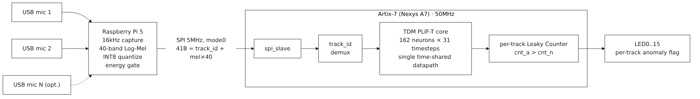
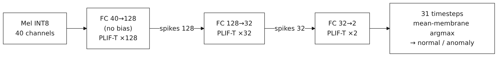
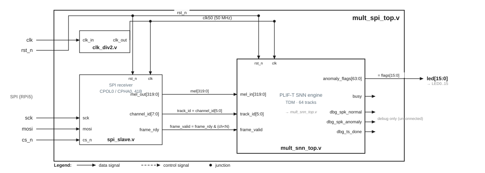

# SpikeSense-Edge

**English** | [한국어](README.ko.md)

---

**FPGA edge-based SNN acoustic anomaly detection system**

---

## 1. Background

Faults in fans and rotating machinery show up first as abnormal sound, but streaming audio to the cloud for analysis carries latency, bandwidth, and privacy costs. SpikeSense-Edge keeps everything from preprocessing to inference at the edge.

- **Preprocessing**: a Raspberry Pi 5 converts mic audio into a Mel Spectrogram (INT8, 40 channels)
- **Inference**: a PLIF-T SNN trained in PyTorch is INT8-quantized and ported onto a Xilinx Artix-7 FPGA for low-power real-time decisions
- An SNN (Spiking Neural Network) uses spike-based sparse computation, well suited to edge inference

---

## 2. System Overview



| Component               | Role                                                                  |
| ----------------------- | --------------------------------------------------------------------- |
| Raspberry Pi 5          | N-channel audio capture, Mel Spectrogram preprocessing, SPI TX        |
| Nexys A7 100T (Artix-7) | PLIF-T SNN inference — multi-track via a single time-shared datapath |

---

## 3. Model & Hardware Architecture

### 3.1 Software Model — PLIF-T SNN

**PLIF-T SNN (Parametric LIF with Learnable Threshold)**



- Input: ~1s audio buffer (31 × 32ms = 992ms) → 40-channel Log-Mel Spectrogram → 31 timesteps
- Neuron: both β (decay) and V_th (firing threshold) are learnable parameters
- Classification: argmax of the per-timestep mean membrane potential → normal (0) / anomaly (1)
- Total weights: 9,280 (INT8-quantized in hardware)

**Training Setup**

| Item         | Value                                               |
| ------------ | --------------------------------------------------- |
| Loss         | Focal Loss (γ=2, class-frequency weighting)        |
| Optimizer    | Adam (lr=0.002, weight_decay=1e-5)                  |
| Scheduler    | Cosine Annealing                                    |
| Augmentation | SpecAugment (freq/time masking 15%), Mixup (α=0.2) |
| Features     | 40-mel, FFT=1024, hop=512, 16kHz                    |

### 3.2 Hardware Architecture — RTL



**Design Spec** (`hardware/src/`)

| Item             | Spec                                                                                                              |
| ---------------- | ----------------------------------------------------------------------------------------------------------------- |
| Target board     | Nexys A7 100T (XC7A100T)                                                                                          |
| Input interface  | SPI slave (5MHz, 41-byte packet)                                                                                  |
| Clock            | 50 MHz (board 100MHz E3 →`clk_div2` divide-by-2)                                                               |
| Channels/tracks  | Multi-track TDM (`N_TRACKS`, default 64) — shared single datapath. Initial dual-channel (snn_top×2) is frozen |
| Processing       | Time-multiplexing — 162 neurons/timestep, ≈9,607 clocks/timestep                                                |
| Weight storage   | BRAM (9,280 × INT8 ≈ 74Kbits, shared across all tracks)                                                         |
| Membrane format  | 16-bit signed, Soft Reset (per-track BRAM)                                                                        |
| Anomaly decision | Per-track Leaky Counter (`cnt_anomaly > cnt_normal`); demo top uses 31-ts majority vote                         |
| Output           | `anomaly_flags[N]` → LED. LED15=PASS during board self-test                                                    |

**Module Map**

| Group        | Modules                                                                                                     |
| ------------ | ----------------------------------------------------------------------------------------------------------- |
| Compute      | `plift_core.v` (PLIF-T neuron), `mac_unit.v` (INT8×INT8→INT16 MAC)                                    |
| Memory       | `weight_bram.v`, `param_rom.v` (β/V_th), `membrane_mem.v` / `membrane_mem_mult.v`, `spike_mem.v` |
| Control      | `control_fsm.v` / `control_fsm_mult.v`, `anomaly_judge.v` / `_mult.v` / `_seg.v`, `clk_div2.v`  |
| Top (frozen) | `snn_top.v` (single), `dual_snn_top.v` (2-ch + `spi_slave.v`)                                         |
| Top (active) | `mult_snn_top.v` (TDM engine), `mult_spi_top.v` (board), `mult_selftest_top.v` (self-test)            |
| Top (demo)   | `demo_snn_top.v` / `demo_spi_top.v` (segment-decision, majority vote)                                   |

**SPI Protocol** (RPi5 → FPGA)

- Wiring: JA1=SCK, JA2=MOSI, JA3=CS_n, GND
- Packet: CS low → 41 bytes → CS high. Byte 0 = `track_id(0~N-1)`, bytes 1~40 = `mel_int8[0..39]`
- 5 MHz, mode 0 (CPOL=0, CPHA=0), frame gap ≥1ms
- Receive-only (MOSI) — no MISO readback. Anomaly decisions are observed via board LED[track]

---

## 4. Directory Structure

```
SpikeSense-Edge/
├── software/
│   ├── snn_model.py            # PLIF-T SNN model definition (PyTorch)
│   ├── train.py                # Training loop (Focal Loss, Mixup, Resume)
│   ├── test_model_numpy.py     # NumPy forward-pass check (no PyTorch needed)
│   ├── export_weights.py       # INT8 weight extraction → hex files
│   ├── evaluate_dcase.py       # Held-out inference → per-segment raw scores CSV
│   ├── plot_metrics.py         # CSV → training curves + ROC / F1 / PR curves
│   ├── make_excel_template.py  # Self-updating F1/ROC/PR Excel template generator
│   ├── make_hw_test_vectors.py # HW-test Mel vectors (LED ON/OFF guaranteed)
│   ├── compare_quant.py        # float32(PyTorch) vs INT8(quantized) accuracy delta
│   ├── best_model_mimii_v2-1.pth  # Best model (MIMII dataset)
│   ├── data_dcase/             # Full training data (DCASE — normal/, anomaly/)
│   └── data_mimii/             # Lightweight validation data (MIMII)
│
├── hardware/
│   ├── src/                    # RTL — Mel + PLIF-T (snn / dual / mult-TDM / selftest / demo tops)
│   │   └── weights/            # INT8 weight hex + golden vectors
│   ├── constraints/            # Vivado XDC pin constraints (dual / mult / selftest / demo)
│   ├── fpga/                   # Vivado automation tcl (project / non-project / selftest)
│   ├── testbench/              # Testbench .v sources
│   └── sim/                    # Compiled outputs (.gitignore)
│
├── rpi/                        # RPi5 software
│   ├── requirements.txt        # numpy, scipy, soundfile, sounddevice, spidev, luma.oled
│   ├── capture_mel.py          # USB mic capture + Mel INT8 (pure numpy)
│   ├── snn_infer.py            # NumPy INT8 inference (dry-run, RTL bit-exact)
│   ├── fpga_spi.py             # SPI driver (5MHz, 41B packet, track_id)
│   ├── main.py                 # Main loop (multi-track pipeline, --dry-run)
│   ├── hw_test.py              # SPI integration test (wiring/led/sweep)
│   ├── oled_display.py         # 1.3" I2C OLED(SH1106) normal/anomaly display (demo)
│   └── demo.py                 # On-board 2-track demo (Enter-stepped, OLED+LED)
│
└── documents/                  # Paper, presentation, study guide
    ├── papers/                 # Conference paper (docx/pdf) + block diagrams
    ├── presentation/           # Poster (pdf/pptx), slides, 12-min script, demo video
    └── study_guide/            # 25-chapter undergraduate study guide (Markdown)
```

---

## 5. Getting Started

### Requirements

```bash
pip install torch numpy librosa soundfile scikit-learn
```

### Data Preparation

```
data_dcase/
├── normal/     # Normal-operation WAV files (16kHz recommended)
└── anomaly/    # Abnormal-operation WAV files
```

Supported datasets: [MIMII Dataset](https://zenodo.org/record/3384388), [DCASE 2020 Task 2](https://dcase.community/challenge2020/task2-unsupervised-detection-of-anomalous-sounds)

### Training

```bash
cd software

# Train from scratch
python train.py --data_dir data_dcase --model_name my_model.pth --epochs 150 --batch_size 256

# Continue training (epochs is the final target, not an increment)
python train.py --data_dir data_dcase --model_name my_model.pth --epochs 300 --resume
```

| Option           | Description                                            | Default            |
| ---------------- | ------------------------------------------------------ | ------------------ |
| `--data_dir`   | Top-level data folder (must contain normal/, anomaly/) | required           |
| `--model_name` | Filename of the weights to save/load                   | `best_model.pth` |
| `--epochs`     | Final target epoch count                               | 150                |
| `--resume`     | Resume epoch/LR/weights from a checkpoint              | False              |
| `--batch_size` | Batch size                                             | 256                |
| `--lr`         | Initial learning rate (Cosine Annealing applied)       | 0.002              |
| `--n_mels`     | Number of Mel bands and input channels                 | 40                 |
| `--segment_ms` | Segmentation unit (ms)                                 | 992                |

### Forward-Pass Check (without PyTorch)

```bash
cd software
python test_model_numpy.py
```

### Evaluation & Analysis

```bash
cd software

# 1) Held-out inference → per-segment raw scores CSV (softmax P(anomaly) + pred/true)
python evaluate_dcase.py --data_dir data_dcase --model best_model_dcase_v2-1.pth --out eval_dcase.csv

# 2) CSV → curves: training history (<model>_history.csv) + ROC / F1-vs-threshold / PR
python plot_metrics.py --history best_model_dcase_history.csv --eval eval_dcase.csv --outdir figs

# 3) float32(PyTorch) vs INT8(quantized/RTL) accuracy delta on data_mimii
python compare_quant.py
```

### Weight Extraction (for RTL)

```bash
cd software
python export_weights.py --model best_model_mimii_v2-1.pth --out ../hardware/src/weights/
```

### Verilog Simulation (iverilog)

> iverilog path: `/usr/bin/iverilog`

**Testbench files** (`hardware/testbench/`)

| File                    | Target module                                                                           | # TC      | External files needed    |
| ----------------------- | --------------------------------------------------------------------------------------- | --------- | ------------------------ |
| `plift_core_tb.v`     | PLIF-T neuron standalone                                                                | 12        | none                     |
| `mac_unit_tb.v`       | MAC standalone                                                                          | —        | none                     |
| `phase2_tb.v`         | Core modules (6)                                                                        | 32        | `weights/*.hex`        |
| `phase3_tb.v`         | control_fsm · snn_top                                                                  | 57        | `weights/*.hex`        |
| `tb_snn_top.v`        | Full-system golden-vector verification                                                  | 312       | `weights/golden/*.hex` |
| `tb_dual_snn_top.v`   | Dual-channel + SPI (mode 0) verification                                                | 314       | `weights/golden/*.hex` |
| `tb_mult_snn_top.v`   | Multi-track TDM core (4-track interleaved golden)                                       | 496       | `weights/golden/*.hex` |
| `tb_mult_spi_top.v`   | SPI-integrated TDM (clk divider + track demux)                                          | 8         | `weights/golden/*.hex` |
| `tb_mult_selftest.v`  | Board self-test (mult_selftest_top) sim — self-compares 62 golden spikes → LED15=PASS | PASS/FAIL | `weights/golden/*.hex` |
| `tb_demo_spi_top.v`   | Demo segment-decision top — user-sequence LED toggle                                   | 8         | `weights/*.hex`        |
| `tb_mult_spi_power.v` | Power-SAIF stimulus-only (Vivado post-impl timing sim)                                  | —        | none (pseudo-random mel) |

```bash
mkdir -p hardware/sim

# Standalone modules — no external files
/usr/bin/iverilog -g2001 -o hardware/sim/plift_core_tb \
    hardware/testbench/plift_core_tb.v hardware/src/plift_core.v && /usr/bin/vvp hardware/sim/plift_core_tb

# Core / control modules (need weights/ hex)
/usr/bin/iverilog -g2001 -o hardware/sim/phase2_tb \
    hardware/testbench/phase2_tb.v hardware/src/*.v && /usr/bin/vvp hardware/sim/phase2_tb
/usr/bin/iverilog -g2001 -o hardware/sim/phase3_tb \
    hardware/testbench/phase3_tb.v hardware/src/*.v && /usr/bin/vvp hardware/sim/phase3_tb

# Full-system golden vector / dual-channel + SPI
/usr/bin/iverilog -g2001 -o hardware/sim/snn_top \
    hardware/testbench/tb_snn_top.v hardware/src/*.v && /usr/bin/vvp hardware/sim/snn_top
/usr/bin/iverilog -g2001 -o hardware/sim/dual_snn_top \
    hardware/testbench/tb_dual_snn_top.v hardware/src/*.v && /usr/bin/vvp hardware/sim/dual_snn_top

# Multi-track TDM (50MHz): core golden / SPI integration / board self-test
/usr/bin/iverilog -g2001 -o hardware/sim/mult_snn_top \
    hardware/testbench/tb_mult_snn_top.v hardware/src/*.v && /usr/bin/vvp hardware/sim/mult_snn_top
/usr/bin/iverilog -g2001 -o hardware/sim/mult_spi_top \
    hardware/testbench/tb_mult_spi_top.v hardware/src/*.v && /usr/bin/vvp hardware/sim/mult_spi_top
/usr/bin/iverilog -g2001 -o hardware/sim/mult_selftest \
    hardware/testbench/tb_mult_selftest.v hardware/src/*.v && /usr/bin/vvp hardware/sim/mult_selftest

# Demo segment-decision SPI top
/usr/bin/iverilog -g2001 -o hardware/sim/demo_spi_top \
    hardware/testbench/tb_demo_spi_top.v hardware/src/*.v && /usr/bin/vvp hardware/sim/demo_spi_top
```

### Synthesis / Implementation / Bitstream (Vivado)

```tcl
# Multi-track TDM board top (mult_spi_top, 50MHz) — main build path
vivado -mode batch -source hardware/fpga/create_project_mult.tcl -tclargs run

# On-board self-test (mult_selftest_top) — no RPi, LED15=PASS ~6ms after reset
vivado -mode batch -source hardware/fpga/create_project_selftest.tcl -tclargs run

# Dual-channel top (dual_snn_top) — Phase 6-1 reference
vivado -mode batch -source hardware/fpga/create_project.tcl -tclargs run
```

> `build_bitstream.tcl` is an alternative **non-project** flow. The PRE hooks `copy_hex*.tcl` copy the `$readmemh` hex files into the synthesis working directory. The project path **must be ASCII** — a non-ASCII path silently crashes the synthesis run.

### Running the RPi5 Software

```bash
cd rpi
pip install -r requirements.txt

python main.py --dry-run   # verify the whole pipeline via numpy inference, no FPGA
python demo.py             # on-board demo (needs FPGA + USB mics)
```

---

## 6. Development Status

**Current state — Phase 9 done.** The 100MHz timing miss (WNS −5.498ns) was solved with multi-track time-division multiplexing (TDM) @50MHz. A single datapath is time-shared across N tracks; only per-track membrane potential and anomaly counter are replicated. 50MHz synthesis/implementation/bitstream completed → **WNS +4.07ns (timing closed)**, LUT 2,007 · FF 4,605 · BRAM36 12 · DSP 1, power 0.124W (dynamic 0.026 + static 0.098). Verification: iverilog (tb_mult_snn_top 496/496, tb_mult_spi_top 8/8, tb_mult_selftest PASS) plus on-board self-test silicon PASS (LED15 lights on golden input, no RPi). RPi5 SW (pure-numpy Mel · energy gate · SPI), on-board SPI integration (10-channel sweep lighting · track isolation, live-mic inference LED lighting), and a segment-decision OLED/LED demo all verified.

### Software

- [X] PLIF-T SNN model design (`snn_model.py`)
- [X] Training loop — Focal Loss, Mixup, SpecAugment, Resume (`train.py`)
- [X] NumPy forward-pass verification script (`test_model_numpy.py`)
- [X] MIMII / DCASE dataset training complete (4 models)
- [X] Evaluation & analysis tooling — `evaluate_dcase.py`, `plot_metrics.py`, `make_excel_template.py`, `compare_quant.py`

### RTL (Mel Spectrogram + PLIF-T)

**Phase 1 — weight/parameter export**

- [X] `export_weights.py` — `best_model_mimii_v2-1.pth` → INT8, W1/W2/W3/β/V_th as `$readmemh` hex
- [X] `test_model_numpy.py` — saves INT8-weight-based golden vectors

**Phase 2 — core compute modules**

- [X] `plift_core.v` (PLIF-T neuron), `mac_unit.v` (INT8×INT8→INT16 accumulate, variable fan-in)
- [X] `weight_bram.v` (9,280×8bit), `param_rom.v` (β/V_th 162), `membrane_mem.v` (162-neuron 16-bit), `spike_mem.v` (L1 128bit / L2 32bit)
- [X] Testbenches `plift_core_tb.v` / `mac_unit_tb.v` / `phase2_tb.v` (32 TC pass)

**Phase 3 — control/integration modules**

- [X] `control_fsm.v` — 3-layer sequencer FSM (L1×128 → L2×32 → L3×2, 31 timesteps)
- [X] `anomaly_judge.v` — Leaky Counter anomaly decision
- [X] `snn_top.v` — top-level integration, `phase3_tb.v` (57 TC pass)

**Phase 4 — golden-vector verification**

- [X] `tb_snn_top.v` — full simulation (312 TC), normal/anomaly each 31 timesteps bit-exact

**Phase 5 — dual-channel RTL + SPI**

- [X] `spi_slave.v` — SPI receiver (CPOL=0, CPHA=0, 41-byte decoder, 2-stage CDC)
- [X] `dual_snn_top.v` — 2-channel top, `nexys_a7_dual.xdc`, `tb_dual_snn_top.v` (314 TC pass)

**Phase 6-1 — Vivado synthesis & implementation (dual-channel)**

- [X] `create_project.tcl` (Top `dual_snn_top`, xc7a100tcsg324-1), hex via `ifdef SYNTHESIS` + PRE hook `copy_hex.tcl`
- [X] Resources LUT 3,211 / FF 7,094 / BRAM36 4 / DSP 2 (each <6%)
- [X] Timing WNS −5.498ns @100MHz (critical path param_rom→PLIF→membrane) → adopt Phase 6-2 TDM @50MHz

**Phase 6-2 — multi-track TDM @50MHz**

- A single datapath (MAC·weight BRAM·param ROM·spike_mem) is time-shared across N_TRACKS tracks, replicating only per-track state (membrane·anomaly counter). At 50MHz the critical path 15.3ns < 20ns has margin.

- [X] `membrane_mem_mult.v` (256-stride BRAM per track, first_ts-masking buffer reset), `anomaly_judge_mult.v` (per-track Leaky Counter)
- [X] `control_fsm_mult.v` (track_id · per-track ts · first_ts), `mult_snn_top.v` (TDM engine), `clk_div2.v` (100→50MHz divide-by-2)
- [X] `mult_spi_top.v` (board top, channel_id=track_id demux → LED[0..15])
- [X] `tb_mult_snn_top.v` (496 TC, 4-track interleaved) / `tb_mult_spi_top.v` (8 TC, SPI integration)
- [X] `create_project_mult.tcl` + `nexys_a7_mult.xdc` (50MHz generated clock)
- [X] **50MHz synthesis/implementation/bitstream complete** (Vivado 2025.2): WNS +4.07ns, LUT 2,007 / FF 4,605 / BRAM36 12 / DSP 1, 0 Warnings
- [X] **Board self-test** — `mult_selftest_top.v` + `create_project_selftest.tcl` + `nexys_a7_selftest.xdc`: on-chip golden anomaly self-compares 62 output spikes → real board PASS (LED15 on). Also PASS via iverilog `tb_mult_selftest.v`

**Phase 7 — RPi5 software**

> ⚠️ Multi-track TDM: the first SPI packet byte must carry `track_id(0~N-1)` (41B format unchanged).
> ⚠️ The current RTL is receive-only (MOSI). Anomaly decisions are observed via board LED[track]; the RPi terminal display is provided by `--monitor` (numpy shadow inference).

- [X] `rpi/capture_mel.py` — USB-mic N-track capture + Mel INT8 (1:1 identical to training preprocessing)
- [X] `rpi/fpga_spi.py` — SPI driver (spidev, 5MHz, mode 0, `[track_id][mel×40]`, 1ms gap, `MockSpi` included)
- [X] `rpi/snn_infer.py` — NumPy INT8 inference (loads hex weights, golden-vector RTL bit-exact PASS)
- [X] `rpi/main.py` — multi-track real-time pipeline (FPGA + `--monitor` / `--dry-run` / `--from-wav` / `--list-mics`)

**Phase 8 — hardware integration test**

> Separate SPI-link verification from mic/model accuracy: the HW anomaly decision is the L3-spike Leaky Counter (`cnt_a>cnt_n`), so the LED is verified with a dedicated vector that reliably satisfies that condition.

- [X] `software/make_hw_test_vectors.py` — generates `hw_anomaly_mel.npy` (LED ON) / `hw_normal_mel.npy` (LED OFF)
- [X] `rpi/hw_test.py` — SPI integration test (`wiring`/`led`/`sweep`)
- [X] Protocol-consistency verification: packet byte order · track→LED mapping · LED-lighting logic PASS. SPI 10→5MHz, frame gap 500µs→1ms applied
- [X] (board) `hw_test.py sweep` → per-track LED sequential lighting = 10-channel SPI demux · track isolation demonstrated
- [X] (board) live-mic inference (`main.py --alsa`) → full mic→Mel→SPI→FPGA→decision path works
- [X] `tb_mult_spi_power.v` — stimulus-only tb for power SAIF

> Test procedure: ① program the `mult_spi_top` bitstream ② wiring (JA1=SCK/JA2=MOSI/JA3=CS_n/GND) ③ initialize `CPU_RESETN` (C12) ④ `cd rpi && python3 hw_test.py sweep --tracks 10` → observe LED0–9 lighting in sequence

**Phase 9 — on-board demo**

- [X] Live demo path — `main.py --alsa plughw:2,0 --monitor` (LED + terminal Leaky Counter prediction together)
- [X] `rpi/demo.py` — on-board 2-track demo (each Enter step sends 2-track SPI + numpy inference)
- [X] `rpi/oled_display.py` — 1.3" I2C OLED(SH1106) normal/anomaly display
- [X] Segment-decision RTL — `anomaly_judge_seg.v` (31-ts majority vote) + `demo_snn_top.v`/`demo_spi_top.v` + `tb_demo_spi_top.v` (PASS 8/0)
- [X] `nexys_a7_demo.xdc` — QSPI flash boot settings added

---

## 7. Extras

### Trained Models

| File                          | Dataset | Note                        |
| ----------------------------- | ------- | --------------------------- |
| `best_model_mimii_v2-1.pth` | MIMII   | **Best, recommended** |
| `best_model_mimii_v1-1.pth` | MIMII   | v1                          |
| `best_model_dcase_v2-1.pth` | DCASE   |                             |
| `best_model_dcase_v1-1.pth` | DCASE   |                             |

### Documents

| Path                        | Contents                                                                          |
| --------------------------- | --------------------------------------------------------------------------------- |
| `documents/papers/`       | Conference paper (docx/pdf) + block diagrams                                      |
| `documents/presentation/` | Poster (pdf/pptx), slide decks (v1~v3), 12-min script, live-demo video            |
| `documents/study_guide/`  | 25-chapter undergraduate study guide (Part 0 basics + Ch 1~24 RTL/SW walkthrough) |

### Dataset Note

- `data_dcase/`: harder, larger — for full training
- `data_mimii/`: easier, smaller — for quick validation
- Do not mix the two datasets

---

## 8. References

- [MIMII Dataset](https://zenodo.org/record/3384388) — Malfunctioning Industrial Machine Investigation and Inspection
- [DCASE 2020 Task 2](https://dcase.community/challenge2020/task2-unsupervised-detection-of-anomalous-sounds) — Unsupervised Detection of Anomalous Sounds
- [Parametric LIF (PLIF)](https://arxiv.org/abs/2011.09226) — Incorporating Learnable Membrane Time Constant to Enhance Learning of SNNs
